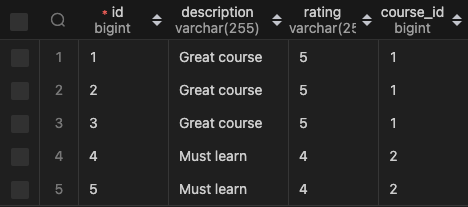
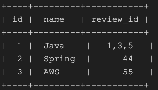
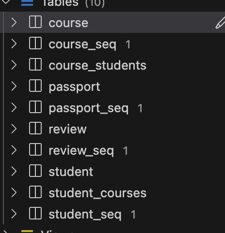
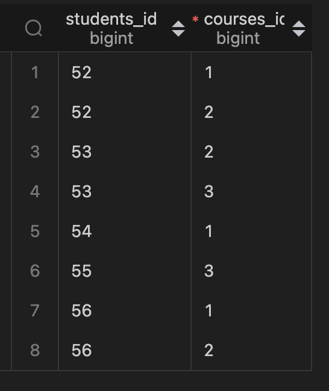

# JPA-Hibernate mappings

> In this project we created 4 tables or entities that are Course, Passport, Review, Student. Going further we will be
> establishing the mappings between them.

## One-to-One mapping

### One-to-one bi-directional

> Let's consider Student and Passport for now. Each student must have only one passport and since passport number is
> unique
> the relation here is oneToOne.

> In 2 ways we can establish OneTwoOne mapping between these two tables
> 1) Using student_id in the Passport table [ In this case Passport table is owning the relationship with student].
> 2) Using passport_id in the Student table [ In this case Student table is owning the relationship with passport].

``` java

@Test
  public void oneToOneMappingBetweenPassportAndStudent(){
    Passport p1 = Passport.builder().passportNumber("ASD135").build();
    Passport p2 = Passport.builder().passportNumber("HJU869").build();
    Passport p3 = Passport.builder().passportNumber("IYT037").build();
    Passport p4 = Passport.builder().passportNumber("TYU238").build();
    Passport p5 = Passport.builder().passportNumber("PEU539").build();

    Student s1 = Student.builder().name("Sai").passport(p1).build();
    Student s2 = Student.builder().name("Manda").passport(p2).build();
    Student s3 = Student.builder().name("sastri").passport(p3).build();
    Student s4 = Student.builder().name("Pb").passport(p4).build();
    Student s5 = Student.builder().name("Katravalli").passport(p5).build();

    studentRepository.saveAll(Arrays.asList(s1, s2, s3, s4, s5));
  }

```
> In the above unitTest we saved Passport as part of student so the Student is on the owning side of the relationship and passport is on the non-owning side of the relationship. Now let see how to create ont 

``` java
public class Student {
  @Id
  @GeneratedValue(strategy = GenerationType.AUTO)
  private Long id;
  private String name;
  @OneToOne(cascade = CascadeType.ALL)
  private Passport passport;
}
```
```java
public class Passport {
  @Id
  @GeneratedValue(strategy = GenerationType.AUTO)
  private Long id;
  private String passportNumber;
  @OneToOne(mappedBy = "passport", cascade = CascadeType.ALL)
  private Student student;
}
```

> *mappedBy* should always be in non owning side of the relationship. As we discussed earlier Address is being saved as part of Student. So, the student is on the owning side of the relationship that right away indicates **mappedBy** should be in the passport entity and on the student property.


## one-many and many-one mappings

> Let's consider Review and Course entities to demonstrate one-many and many-one mappings.

``` java
public class Review {
  @Id
  @GeneratedValue(strategy = GenerationType.AUTO)
  private Long id;
  private String rating;
  private String description;

  @ManyToOne(cascade = CascadeType.ALL)
  private Course course;
  // Always compare with the class name and the property, class is Review and the property is Course, Many - refers to -> Class and One -refers to -> property. As a matter of fact a course can have many reviews. ManyToOne -> Many Reviews to One Course.
}
```
``` java
public class Course {
    @Id
    @GeneratedValue(strategy = GenerationType.AUTO)
    private Long id;
    private String name;

    @OneToMany(mappedBy = "course", cascade= CascadeType.ALL)
    private List<Review> reviews = new ArrayList<>();
    // just like the discussion in the Review class commented lines, OneToMany --> One Course has Many Reviews.
}
```

``` java
@Test
  public void manyToOneMappingBetweenReviewAndCourse() {
    Course c1 = Course.builder().name("Spring Boot").build();
    Course c2 = Course.builder().name("Microservices").build();
    Course c3 = Course.builder().name("RestAPI").build();
    Course c4 = Course.builder().name("Docker").build();
    Course c5 = Course.builder().name("K8s").build();

    Review r1 = Review.builder().rating("5").description("Great course").course(c1).build();
    Review r2 = Review.builder().rating("5").description("Great course").course(c1).build();
    Review r3 = Review.builder().rating("5").description("Great course").course(c1).build();
    Review r4 = Review.builder().rating("4").description("Must learn").course(c3).build();
    Review r5 = Review.builder().rating("4").description("Must learn").course(c3).build();

    reviewRepository.saveAll(Arrays.asList(r1, r2, r3, r4, r5));
    courseRepository.saveAll(Arrays.asList(c1, c2, c3, c4, c5));
    // the reason behind above line is to just show all the courses in the dataBase. If not only c1 and c3 will appear on the course table as we just gave reviews to c1 and c3 in the reviews.
  }
```

> Look at the above provided entity classes and Test to save the data, below screenshots show how  the data looks like in the tables.

 --> Course table
 --> Review table


> Try to write the tables in the paper, Course has id and name and hte review has id, rating, description.Designing the tables is also very important to identify which table should stand on the owning side. 

> If we try to make course as owning side that should contain the **review_id** the problem in making course as owning side is if we have **review_id** in hte course making it owning side, Java course may have multiple reviews and it may look like



In the above image data is sitting next to each other which is not a good database design.
so, when we make the owing side as Review it looks like review table in the above DB screen shots.

> **IMP** --> So we go ahead and make Review as owning table and as we already know if we make a table owning, **mappedBy** must be on the non owning side that is Course.


## Many-to-Many

Consider Course and Student every student must have got enrolled to multiple courses and every course must be having multiple students. So, in this case we go for ManyToMany relationship

> Now lets look into the table design of ManyToMany, since we have may students to each course and multiple courses to every students if we try to fit all the details the table would look like the above image having details sitting next to each other, which is possibly not the way we desgin.

> Considering the above conditions the concept of joint tables comes into picture. we would create a joint table something like STUDENT_COURSE having student_id and course_id as columns.

``` java
public class Student {
  @Id
  @GeneratedValue(strategy = GenerationType.AUTO)
  private Long id;
  private String name;

  @OneToOne(cascade = CascadeType.ALL)
  private Passport passport;

  @ManyToMany
  private List<Course> courses = new ArrayList<>();
}
```

``` java
public class Course {
    @Id
    @GeneratedValue(strategy = GenerationType.AUTO)
    private Long id;
    private String name;

    @OneToMany(mappedBy = "course", cascade= CascadeType.ALL)
    private List<Review> reviews = new ArrayList<>();

    @ManyToMany
    private List<Student> students = new ArrayList<>();
}
```

look into the entities both Course and Student has many to many relationships.
> An important thing comes up that needs attention is later adding ManyToMany raltionships in both the classes **2 joint tables** gets created like shown below



> Both the joint tables contains the contains the columns course_id and student_id. So, one of the table is redundant.

> Simple solution to this is making an entity a owning side, since they are ManyToMany it won't matter which table should stand on owning side.

``` java
// Course class
@ManyToMany(mappedBy = "courses") // the value courses must match with (I)
    private List<Student> students = new ArrayList<>();

// Student class
 @ManyToMany          // (I) 
  private List<Course> courses = new ArrayList<>();
```
As we already know mappedBy should be in the non-owning side. Student is the owning side.

> If we want to change the names of the table and columns below annotations are needed
``` java
// Student class
@JoinTable(name = "STUDENT_COURSE",
joinColumns = @JoinColumn(name = "STUDENT_ID")
inverseJoinColumns = @JoinColumn(name = "COURSE_ID")
 @ManyToMany          
  private List<Course> courses = new ArrayList<>();
)
```
> inverseJoinColumns is used to set the name of the inversely related to the student that is course, so to change the name of the course we use inverseJoinColumn. 

```java
 @Test
  public void Many2ManyBtwnStudentAndCourse() {
    Course c1 = Course.builder().name("Spring Boot").build();
    Course c2 = Course.builder().name("Microservices").build();
    Course c3 = Course.builder().name("RestAPI").build();
    Course c4 = Course.builder().name("Docker").build();
    Course c5 = Course.builder().name("K8s").build();

    courseRepository.saveAll(Arrays.asList(c1, c2, c3, c4, c5));
    studentRepository.saveAll(Arrays.asList(
        Student.builder().name("Sai").courses(Arrays.asList(c1, c2)).build(),
        Student.builder().name("Manda").courses(Arrays.asList(c2, c3)).build(),
        Student.builder().name("Sastri").courses(Arrays.asList(c1)).build(),
        Student.builder().name("Pb").courses(Arrays.asList(c3)).build(),
        Student.builder().name("Katravalli").courses(Arrays.asList(c1, c2)).build()));
  }
```
> Here is the Tets to save the data  and below screenshot shows how the data in the student_course looks like

