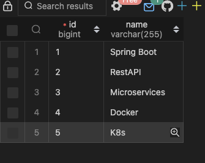

# JPA-Hibernate mappings

> In this project we created 4 tables or entities that are Course, Passport, Review, Student. Going further we will be
> establishing the mappings between them.

## One-to-One mapping

### One-to-one bi-directional

> Let's consider Student and Passport for now. Each student must have only one passport and since passport number is
> unique
> the relation here is oneToOne.

> In 2 ways we can establish OneTwoOne mapping between these two tables
> 1) Using student_id in the Passport table [ In this case Passport table is owning the relationship with student].
> 2) Using passport_id in the Student table [ In this case Student table is owning the relationship with passport].

``` java

@Test
  public void oneToOneMappingBetweenPassportAndStudent(){
    Passport p1 = Passport.builder().passportNumber("ASD135").build();
    Passport p2 = Passport.builder().passportNumber("HJU869").build();
    Passport p3 = Passport.builder().passportNumber("IYT037").build();
    Passport p4 = Passport.builder().passportNumber("TYU238").build();
    Passport p5 = Passport.builder().passportNumber("PEU539").build();

    Student s1 = Student.builder().name("Sai").passport(p1).build();
    Student s2 = Student.builder().name("Manda").passport(p2).build();
    Student s3 = Student.builder().name("sastri").passport(p3).build();
    Student s4 = Student.builder().name("Pb").passport(p4).build();
    Student s5 = Student.builder().name("Katravalli").passport(p5).build();

    studentRepository.saveAll(Arrays.asList(s1, s2, s3, s4, s5));
  }

```
> In the above unitTest we saved Passport as part of student so the Student is on the owning side of the relationship and passport is on the non-owning side of the relationship. Now let see how to create ont 

``` java
public class Student {
  @Id
  @GeneratedValue(strategy = GenerationType.AUTO)
  private Long id;
  private String name;
  @OneToOne(cascade = CascadeType.ALL)
  private Passport passport;
}
```
```java
public class Passport {
  @Id
  @GeneratedValue(strategy = GenerationType.AUTO)
  private Long id;
  private String passportNumber;
  @OneToOne(mappedBy = "passport", cascade = CascadeType.ALL)
  private Student student;
}
```

> *mappedBy* should always be in non owning side of the relationship. As we discussed earlier Address is being saved as part of Student. So, the student is on the owning side of the relationship that right away indicates **mappedBy** should be in the passport entity and on the student property.


## one-many and many-one mappings

> Let's consider Review and Course entities to demonstrate one-many and many-one mappings.

``` java
public class Review {
  @Id
  @GeneratedValue(strategy = GenerationType.AUTO)
  private Long id;
  private String rating;
  private String description;

  @ManyToOne(cascade = CascadeType.ALL)
  private Course course;
}
```
``` java
public class Course {
    @Id
    @GeneratedValue(strategy = GenerationType.AUTO)
    private Long id;
    private String name;

    @OneToMany(mappedBy = "course", cascade= CascadeType.ALL)
    private List<Review> reviews = new ArrayList<>();
}
```

``` java
@Test
  public void manyToOneMappingBetweenReviewAndCourse() {
    Course c1 = Course.builder().name("Spring Boot").build();
    Course c2 = Course.builder().name("Microservices").build();
    Course c3 = Course.builder().name("RestAPI").build();
    Course c4 = Course.builder().name("Docker").build();
    Course c5 = Course.builder().name("K8s").build();

    Review r1 = Review.builder().rating("5").description("Great course").course(c1).build();
    Review r2 = Review.builder().rating("5").description("Great course").course(c1).build();
    Review r3 = Review.builder().rating("5").description("Great course").course(c1).build();
    Review r4 = Review.builder().rating("4").description("Must learn").course(c3).build();
    Review r5 = Review.builder().rating("4").description("Must learn").course(c3).build();

    reviewRepository.saveAll(Arrays.asList(r1, r2, r3, r4, r5));
    courseRepository.saveAll(Arrays.asList(c1, c2, c3, c4, c5));
  }
```

> Look at the above provided entity classes and Test to save the data, below screenshots show how  the data looks like in the tables.
 --> Course table
 --> Review table

